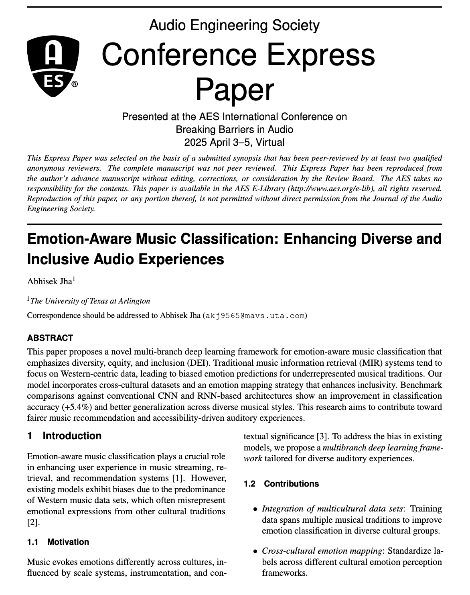
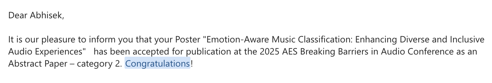

# Emotion‑Aware Music Classification

> **Enhancing Diverse and Inclusive Audio Experiences**
>
> Accepted as a **Poster – Abstract Paper (Category 2)** at the **AES International Conference on Breaking Barriers in Audio, 2025**.

  
  

---

## Abstract
This repository accompanies the paper **“Emotion‑Aware Music Classification: Enhancing Diverse and Inclusive Audio Experiences.”**

Traditional music–information‑retrieval (MIR) pipelines are predominantly trained on Western‑centric corpora, leading to biased emotion predictions for under‑represented musical traditions. We propose a **multi‑branch deep‑learning framework** trained on cross‑cultural datasets and an **emotion‑mapping strategy** that aligns heterogeneous label taxonomies. Experiments show **+5.4 pp** accuracy over strong CNN/RNN baselines and markedly better generalisation to diverse musical styles. Our goal is to foster **fairer music recommendation, accessibility‑oriented design, and diversity, equity & inclusion (DEI)‑aware MIR.**

---

## Key Contributions

- **Integration of multicultural data sets** – Training data spans multiple musical traditions to improve emotion classification in diverse cultural groups.
- **Cross‑cultural emotion mapping** – Standardises labels across different cultural emotion‑perception frameworks.
- **Multi‑branch architecture** – Specialised subnetworks capture timbre, rhythm, and lyrical cues, fused via attention.
- **Fairness evaluation suite** – Includes DEI metrics beyond top‑1 accuracy to measure cultural bias.

---

## License
Distributed under the **MIT License** – see [`LICENSE`](LICENSE) for details.

---

## Contact & Questions
Feel free to open an issue or reach out 📧 **abhisekjha2020[at].gmail.com**.

---

  © 2025 Abhisek Jha – The University of Texas at Arlington.

